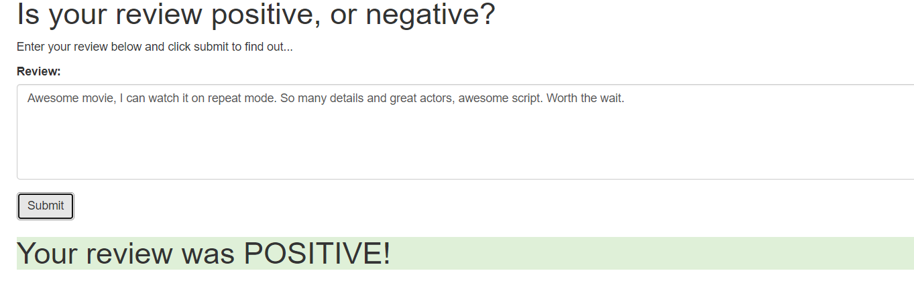
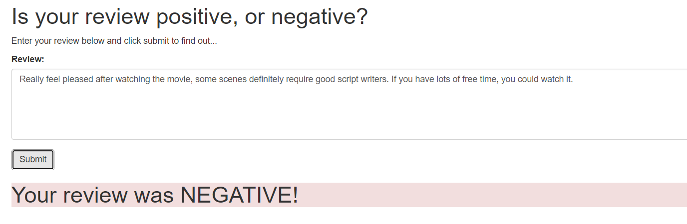

# SageMaker Deployment Project

The notebook and Python files provided here, once completed, result in a simple web app which interacts with a deployed recurrent neural network performing sentiment analysis on movie reviews. This project assumes some familiarity with SageMaker, the mini-project, Sentiment Analysis using XGBoost, should provide enough background.

Please see the [README](https://github.com/udacity/sagemaker-deployment/tree/master/README.md) in the root directory for instructions on setting up a SageMaker notebook and downloading the project files (as well as the other notebooks).

#Sentiment Analysis Model using SageMaker

The notebook and Python files provided here, are complete, result in a simple web app which interacts with a deployed recurrent neural network performing sentiment analysis on movie reviews. This project assumes some familiarity with SageMaker, the mini-project, Sentiment Analysis using XGBoost, should provide enough background.






## Project Overview
In this project, I have used Amazon SageMaker to explore, train and deploy the LSTM network for sentiment analysis. The goal of the project was to have a simple web page for the user to enter a movie review. The web page will communicate via an API to Amazon Lambda service which calls the end point for the deployed model.


## Project Instruction

### Instruction

1. Clone the repository and navigate to the downloaded folder.
	```
		git clone https://github.com/ayowolet/Deploying-a-Sentiment-Analysis-Model
	```
2. Open the `SageMaker Project.ipynb` file. Of course, you can find HTML version of the file.
	```
		jupyter notebook SageMaker Proejct.ipynb
	```
3. Read and follow the instructions! You can find and download the dataset for this project in the notebook.

## Project Information

### Contents

- General Outline
- Step 1: Downloading the data
- Step 2: Preparing and Processing the data
- Step 3: Upload the data to S3 Bucket
- Step 4: Build and Train the PyTorch Model on an ml.p2.xlarge GPU compute instance
- Step 5: Testing the Model
- Step 6: Deploying the model for testing
- Step 7: Use the model for testing
- Step 6 (again): Deploy the model for the web app(End Point creation, Inference, Lambda Deployment)
- Step 7 (again): Use the model for the web app

### Libraries

- [Amazon SageMaker](https://aws.amazon.com/sagemaker) (Build, train, and deploy a model)
- [PyTorch](https://pytorch.org) 

### Delete the Endpoint
Remember to always __SHUT DOWN YOUR ENDPOINT__ if you are no longer using it. You are charged for the length of time that the endpoint is running so if you forget and leave it on you could end up with an unexpectedly large bill.
```
	predictor.delete_endpoint()
```